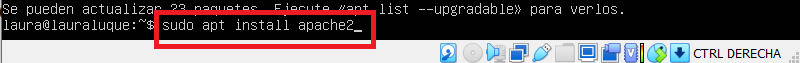
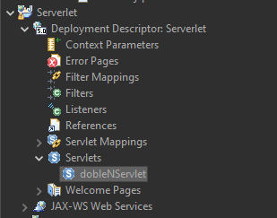
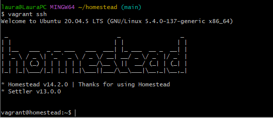

# LAURA LUQUE BRAVO
## Actividades Unidad 1
### Actividades:

[Actividad 1](#actividad-1)

[Actividad 2](#actividad-2)

[Actividad 3](#actividad-3)

[Actividad 4](#actividad-4)

---
### Actividad 1
**Objetivo: Instalar y configurar un paquete software que integre Apache, PHP y MSQL.**

Se puede ver cómo funciona correctamente **phpmyadmin** ya que muestra la página completa sin errores. 

También se puede ver cómo se vería un **porfolio** básico con mis datos.

---
### Actividad 2
**Objetivo: Instalación y configuración de un entorno web utilizando una máquina virtual.**

*1. Descargar e instalar VirtualBox.*
Después de descargarlo e instalarlo se vería de la siguiente forma:

*2. Crear una máquina virtual con Ubuntu Server e instalar de manera independiente: Apache, MariaDB, PHP y phpMyAdmin.*

Una vez creada la máquina virtual con Ubuntu Server, instalo Apache:

Ahora vamos a instalar MariaDB:

Ahora instalo PHP:

Instalación phpmyadmin:

*3. Configurar la conexión entre el entorno de trabajo y el servidor.*

Para configurar la conexión, he utilizado un plugin en Visual Studio Code:

Configuramos con la IP de nuestra máquina Ubuntu Server el plugin, ponemos nombre a la conexión y la conexión se vería de la siguiente manera:

En mi caso he navegado hasta la carpeta /var/www/html/ y he abierto el archivo index.html que visualizaría la página de phpmyadmin.

*4. Probar la aplicación creando un porfolio personal básico.*

Para probar la conexión, voy a crear un portfolio básico dentro de la ruta anterior llamado datos.php:

Y para probarlo, podemos abrir el documento con la IP del servidor en nuestro navegador con la siguiente dirección: *http://192.168.32.20/datos.php*

---
### Actividad 3
**Objetivo: Crear una aplicación que permita calcular el doble de un número utilizando como tecnologías del lado del servidor, Java, JSP, Servlets y Apache TomCat.**

Para el desarrollo de la actividad, vamos a instalar el entorno de trabajo integrado Eclipse. 
Una vez los tenemos instalado, se instala Tomcat, que es un contenedor de servlets, parra ello nos dirigimos a **Preferencias->Server->Runtime Enviroment**.
Aquí buscamos, instalamos y añadimos *apache-tomcat* en Eclipse.

Una vez añadido, podemos crear un nuevo proyecto del tipo *Dynamic Web Project*. Para ello, nos dirigimos a **File->New->Dynamic Web Project**:

En la parte izquierda se nos habrá creado el proyecto. Si navegamos por los distintos directorios, llegamos a un archivo con extensión *.jsp*, lo abrimos y vamos a modificar la salida añadiendo *Hello Word!*.
Una vez se añada, lo mostramos en un navegador, quedando de la siguiente manera:

Ahora vamos a desarrollar una aplicación para calcular el doble de  un número, para ello, nos dirigimos nuevamente al fichero con extensión *.jsp* y modificamos el encabezado y añadimos un formulario, quedando de la siguiente manera:

**Preguntas sobre el código:**
- ¿Para qué se utiliza el atributo action?
  El atributo action es donde se especifica la url a la que se enviará la solicitud cuando se envíe el formulario.

- ¿Para qué se utiliza el atributo method?
  El atributo method especiifica el método HTTP que se utilizará para enviar el formulario al servidor. En este caso se ha puesto post, por lo que los datos del formulario no son visibles en la url.
- ¿Para qué se utiliza el atributo name?
  El atributo name se utiliza para dar nombre a un elemento de entrada del formulario, por lo que cuando se envíe el formulario al servidor, se podrá acceder a ese valor utilizando el nombre "numero" como clave para obtener el valor que introdujo el usuario.

Ahora se va a crear un fichero tipo Servlet, para ello nos dirigimos a la siguiente localización dentro de Ecliopse:

Una vez creado, navegamos por las carpetas que tendremos en la parte izquierda del proyecto nuevo creado, hasta llegar al siguiente documento llamado *dobleNServlet*:

Dentro del documento, lo modificamos para que calcule el doble de un número, quedando de la siguiente manera:

Guardamos y probamos a abrir la aplicación en nuestro navegador, quedando de la siguiente manera:

---

### Actividad 4
**Objetivo: Crear un entorno virtual para desarrollo en el lado del servidor.**

Para realizar esta actividad, vamos a instalar y configurar **Vagrant**.
Una vez lo tengamos instalado en nuestro ordenador, comprobamos que efectivasmente esta instalado, para ello indicamos el comando en consola para ver la versión de Vagrant:

Ahora vamos a añadir el proyecto *Laravel Homstead* seleccionando VirtualBox, para ello nos dirigimos a Git bash e indicamos el siguiente comando:

Vamos a clonar el proyecto de *Laravel Homstead* en el directorio de trabajo, para ello en Git bash indicamos el siguiente comando:

Ahora iniciamos Homstead:

Abrimos con Visual Studio Code el archivo `Homestead.yaml` y copiamos la ip que nos aparece, ya que la usaremos más adelante en otro archivo:

Guardamos y nos dirigimos a la consola e indicamos el comando para lanzar la máquina:

Ahora vamos a incluir en el fichero hosts el nombre y la dirección ip del archivo `Homstead.yaml`:

Vamos a crear una página que muestre *Hello Vagrant*, para ello, nos conectamos a através de ssh a la máquina de Vagrant y creamos un archivo llamado `index.html`:

Guardamos el archivo y mostramos la página en un navegador, quedando de la siguiente manera:

